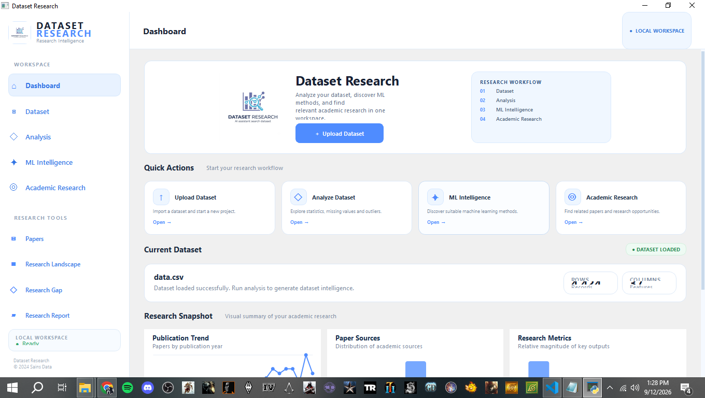
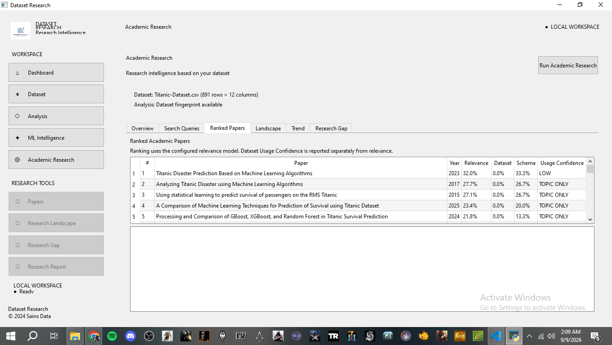
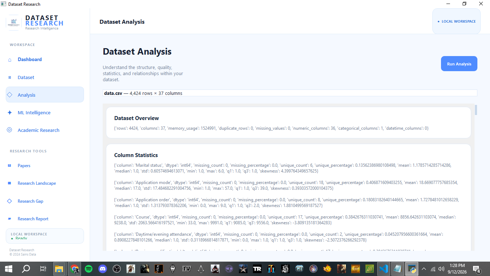
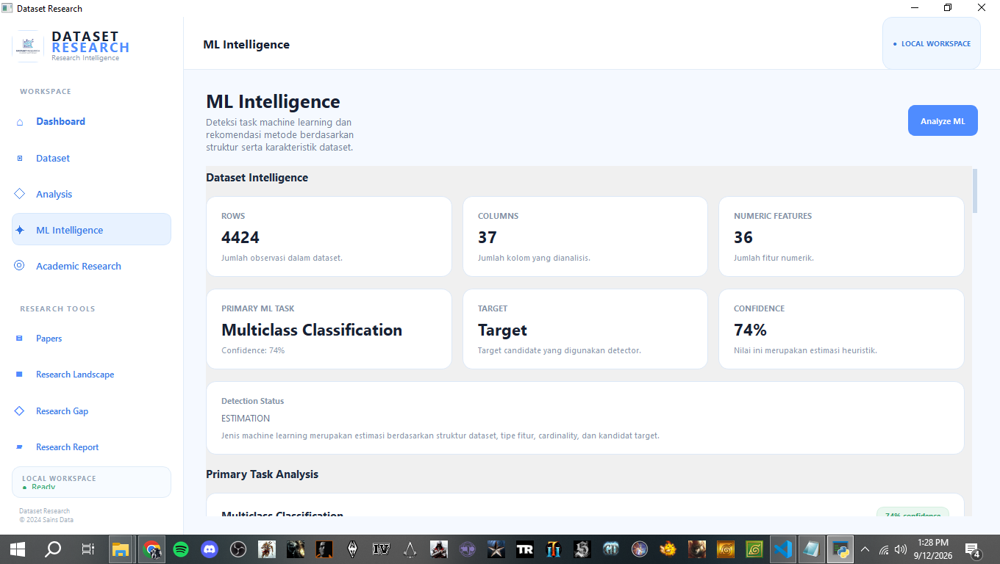
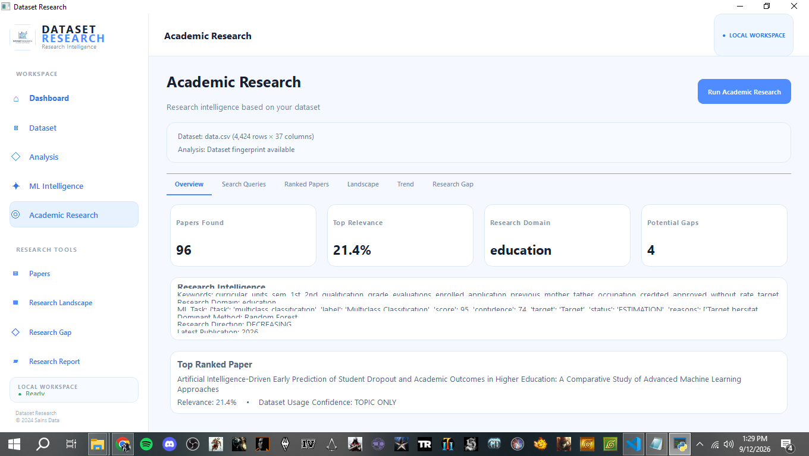
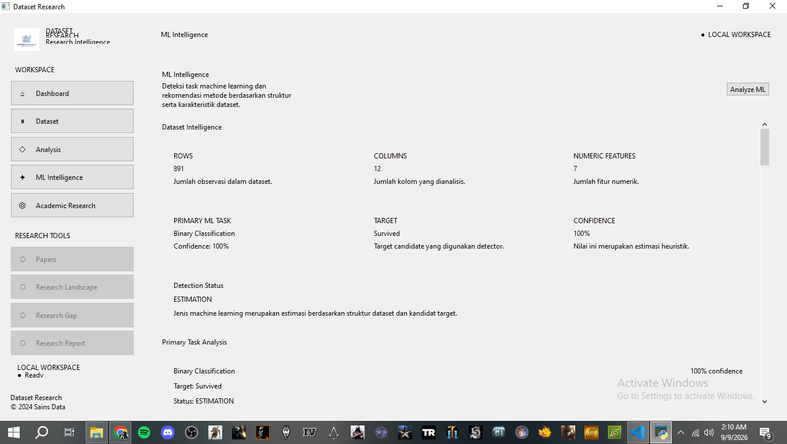
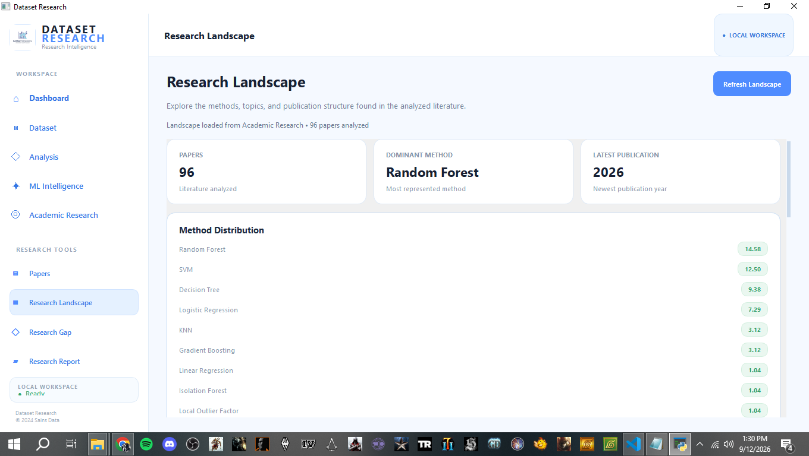
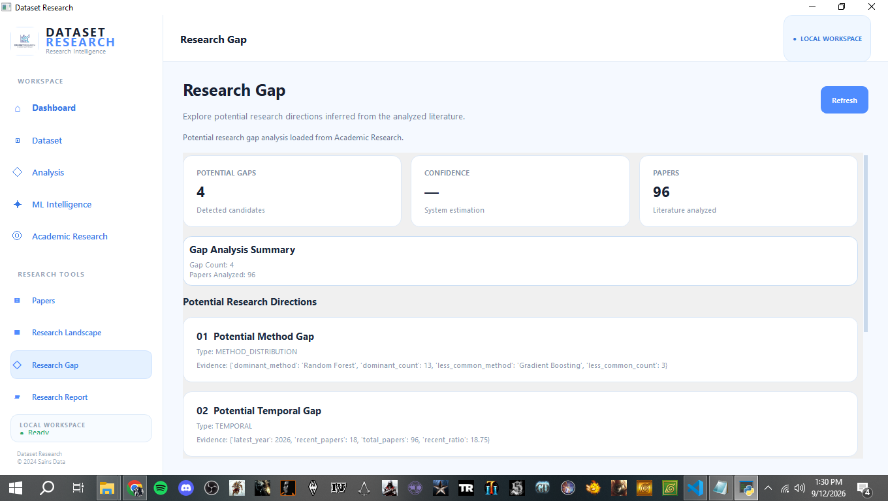
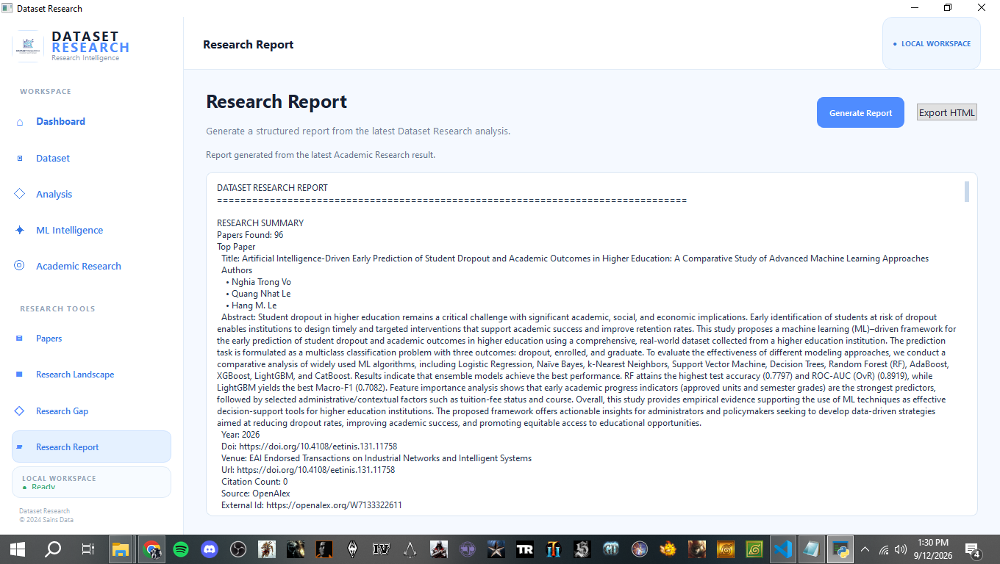

# Dataset Research

> **AI-assisted desktop application for dataset analysis and academic research intelligence.**



Dataset Research is a desktop application designed to help **Data Science students and researchers** transform datasets into meaningful research insights.

The application combines **dataset analysis, Machine Learning intelligence, NLP, academic literature search, and research analysis** into a single desktop workspace.

Instead of only analyzing a dataset, Dataset Research helps users understand:

- What is inside the dataset?
- What problems exist in the data?
- What Machine Learning methods may be suitable?
- What previous research has been conducted?
- How relevant are existing academic papers?
- What research opportunities may be explored further?

---

# Preview

The application provides a complete research workflow from dataset upload to research reporting.

### 1. Dashboard

The main workspace provides an overview of the dataset research workflow, quick actions, current dataset status, research pipeline, and research tools.


### 2. Dataset Upload

The Dataset Upload page is used to load a CSV dataset into the workspace before starting the analysis workflow.



### 3. Dataset Analysis

The Dataset Analysis page presents dataset structure, statistics, missing values, duplicates, outliers, correlations, and dataset fingerprint information.



### 4. ML Intelligence

The ML Intelligence page estimates the possible Machine Learning task and recommends suitable algorithms based on dataset characteristics.



### 5. Academic Research

Academic Research connects the analyzed dataset with relevant academic literature using generated research queries and research intelligence.



### 6. Papers

The Papers research tool provides access to ranked academic papers discovered during the research process, including paper relevance and metadata.



### 7. Research Landscape

The Research Landscape tool summarizes the existing research environment, including methods, topics, publication patterns, and other landscape signals.



### 8. Research Gap

The Research Gap tool presents **potential research gaps** and research opportunities inferred from the collected literature and dataset context.



### 9. Research Report

The Research Report tool brings the research findings together into a structured report covering the dataset, ML intelligence, academic literature, landscape, trends, and potential research gaps.



---

# About The Project

Finding a suitable research topic from a dataset can be challenging.

Researchers often need to perform several different tasks manually, including:

1. Understanding the dataset
2. Cleaning and profiling the data
3. Determining suitable Machine Learning approaches
4. Searching academic literature
5. Comparing previous studies
6. Identifying potential research opportunities

Dataset Research was created to bring these processes into one structured workflow.

The application follows this general pipeline:

```text
UPLOAD DATASET
       ↓
DATASET ANALYSIS
       ↓
DATASET FINGERPRINT
       ↓
KEYWORD EXTRACTION
       ↓
RESEARCH DOMAIN DETECTION
       ↓
ML TASK DETECTION
       ↓
ML METHOD ANALYSIS
       ↓
ACADEMIC PAPER SEARCH
       ↓
PAPER ANALYSIS
       ↓
DATASET / TOPIC / METHOD MATCHING
       ↓
RELEVANCE RANKING
       ↓
RESEARCH LANDSCAPE
       ↓
RESEARCH TREND
       ↓
POTENTIAL RESEARCH GAP
       ↓
RESEARCH REPORT
```

The goal is not to automatically generate research.

Dataset Research acts as a **research intelligence assistant** that provides analytical information to support human decision-making.

---

# Features

## Dataset Analysis

Dataset Research analyzes the structure and characteristics of an uploaded dataset.

Features include:

- Dataset loading
- Dataset profiling
- Number of rows and columns
- Data type detection
- Missing-value analysis
- Duplicate detection
- Descriptive statistics
- Outlier detection
- Correlation analysis
- Dataset fingerprinting

The original dataset is not modified during the analysis process.

---

# Machine Learning Intelligence

Dataset Research analyzes dataset characteristics to determine possible Machine Learning tasks.

Supported task categories include:

- Classification
- Regression
- Clustering
- Anomaly Detection

The system can then provide recommendations for suitable Machine Learning methods.

---

# Machine Learning Methods

## Classification

Examples of supported methods:

- Logistic Regression
- Decision Tree
- Random Forest
- Support Vector Machine
- K-Nearest Neighbors
- Naive Bayes
- Gradient Boosting
- XGBoost

## Regression

Examples include:

- Linear Regression
- Ridge Regression
- Lasso Regression
- Decision Tree Regressor
- Random Forest Regressor
- Gradient Boosting Regressor
- XGBoost Regressor

## Clustering

Examples include:

- K-Means
- DBSCAN
- Agglomerative Clustering

## Evaluation Metrics

Depending on the detected Machine Learning task, appropriate evaluation metrics can be suggested.

### Classification

- Accuracy
- Precision
- Recall
- F1-Score
- ROC-AUC

### Regression

- MAE
- MSE
- RMSE
- R²

The recommended method is an **analytical recommendation**, not an absolute decision. The final algorithm should be selected and evaluated by the researcher.

---

# Academic Research Intelligence

One of the main features of Dataset Research is its ability to search academic literature related to the uploaded dataset.

Research queries can be generated using information such as:

- Dataset keywords
- Dataset characteristics
- Research domain
- Machine Learning task
- Recommended ML methods

Academic literature can be retrieved from:

- OpenAlex
- Crossref

The retrieved papers can then be processed, deduplicated, analyzed, and ranked.

---

# Research Tools

Dataset Research provides dedicated research tools that build on the results of the Academic Research pipeline.

## Papers

The Papers tool provides a focused view of academic publications collected by the research pipeline.

It can be used to inspect information such as:

- Paper title
- Authors
- Abstract
- Publication year
- DOI
- Venue
- Citation count
- Source
- Keywords
- Relevance score

## Research Landscape

The Research Landscape tool summarizes the research environment around the current dataset or research topic.

It can help identify:

- Common research topics
- Frequently used ML methods
- Publication patterns
- Dominant methods
- Related academic studies

## Research Gap

The Research Gap tool highlights **potential** research opportunities based on the available literature and detected research patterns.

Potential signals may include:

- Underexplored combinations of topics and methods
- Limited research around certain dataset characteristics
- Different approaches used by previous studies
- Emerging research trends
- Areas with fewer related publications

## Research Report

The Research Report tool brings the available research intelligence into a structured report.

The report can summarize:

- Dataset overview
- Keywords
- Research domain
- ML task and recommended methods
- Academic paper findings
- Research landscape
- Research trends
- Potential research gaps

Research results remain analytical and should be validated by the researcher.

---

# Paper Analysis

Academic papers can contain information such as:

- Title
- Authors
- Abstract
- Publication year
- DOI
- Venue
- Citation count
- Source
- Keywords

This information is used to determine how relevant a paper may be to the current dataset and research context.

---

# Research Matching

Dataset Research can compare dataset characteristics with academic literature.

The matching process may consider:

- Dataset similarity
- Topic similarity
- Research domain
- Machine Learning methods
- Keywords
- Semantic similarity
- Paper relevance

Similarity scores are treated as **analytical signals**.

They do not prove that two datasets, papers, or research studies are identical.

---

# NLP & Semantic Analysis

Natural Language Processing is used to help connect datasets with academic literature.

The project can use:

- Keyword extraction
- TF-IDF
- Text embeddings
- Semantic similarity
- Research-domain detection

These techniques help transform dataset and research information into searchable and comparable representations.

---

# Research Landscape

The Research Landscape component provides an overview of existing research around a dataset or topic.

It can help identify:

- Common research topics
- Frequently used ML methods
- Research trends
- Related academic studies
- Areas with relatively limited coverage

---

# Potential Research Gap

Dataset Research can assist researchers in exploring potential research gaps.

Potential signals may include:

- Underexplored combinations of topics and methods
- Limited research around certain dataset characteristics
- Different approaches used by previous studies
- Emerging research trends
- Areas with fewer related publications

Research gaps generated by the system are **potential opportunities**, not definitive academic conclusions.

Researchers should verify these findings by examining the original literature.

---

# Research Methodology

## 1. Statistical Analysis

Statistical analysis is used to understand the structure and quality of the dataset.

Examples:

- Descriptive statistics
- Missing-value analysis
- Duplicate detection
- Outlier detection
- Correlation analysis

---

## 2. Dataset Fingerprinting

Dataset fingerprinting creates a compact representation of the dataset characteristics.

The fingerprint can contain information such as:

- Dataset dimensions
- Column characteristics
- Data types
- Numerical/categorical composition
- Statistical characteristics

This information can later be used during research matching.

---

## 3. Keyword Extraction

Important terms are extracted from the dataset and its metadata.

These keywords are used to generate more relevant academic search queries.

---

## 4. Research Domain Detection

The system attempts to identify the general research domain represented by a dataset.

Possible domains include:

- Education
- Healthcare
- Finance
- Transportation
- Business
- Social Science
- Technology

The detected domain is an inference and should be validated by the researcher.

---

## 5. Machine Learning Task Detection

Dataset characteristics are analyzed to identify possible Machine Learning tasks.

For example:

```text
Target Column
      ↓
Target Characteristics
      ↓
Task Detection
      ↓
Classification / Regression
      ↓
Method Recommendation
```

---

## 6. Academic Search

Search queries are generated from dataset analysis results.

The application uses academic APIs to retrieve related publications.

### Primary Source

**OpenAlex**

### Secondary Source

**Crossref**

---

## 7. Relevance Ranking

Retrieved academic papers are ranked using multiple relevance signals.

Possible signals include:

- Keyword similarity
- Topic similarity
- Dataset similarity
- ML method similarity
- Publication information

---

## 8. Semantic Similarity

Semantic similarity can be used to compare textual information such as:

- Dataset descriptions
- Research topics
- Paper abstracts
- Keywords

Semantic similarity should be interpreted as a **similarity measure**, not proof of research equivalence.

---

# Research Workflow

```text
┌──────────────────────┐
│    Upload Dataset    │
└──────────┬───────────┘
           ↓
┌──────────────────────┐
│   Dataset Analysis   │
└──────────┬───────────┘
           ↓
┌──────────────────────┐
│ Dataset Fingerprint  │
└──────────┬───────────┘
           ↓
┌──────────────────────┐
│  Keyword Extraction  │
└──────────┬───────────┘
           ↓
┌──────────────────────┐
│ Research Domain      │
│ Detection            │
└──────────┬───────────┘
           ↓
┌──────────────────────┐
│   ML Task Detection  │
└──────────┬───────────┘
           ↓
┌──────────────────────┐
│   ML Method Analysis │
└──────────┬───────────┘
           ↓
┌──────────────────────┐
│  Academic Paper      │
│       Search         │
└──────────┬───────────┘
           ↓
┌──────────────────────┐
│    Paper Analysis    │
└──────────┬───────────┘
           ↓
┌──────────────────────┐
│ Dataset / Topic /    │
│ Method Matching      │
└──────────┬───────────┘
           ↓
┌──────────────────────┐
│   Relevance Ranking  │
└──────────┬───────────┘
           ↓
┌──────────────────────┐
│   Research Landscape │
└──────────┬───────────┘
           ↓
┌──────────────────────┐
│    Research Trend    │
└──────────┬───────────┘
           ↓
┌──────────────────────┐
│   Potential Research │
│          Gap         │
└──────────┬───────────┘
           ↓
┌──────────────────────┐
│    Research Report   │
└──────────────────────┘
```

---

# Technology Stack

| Category             | Technology                    |
| -------------------- | ----------------------------- |
| Programming Language | Python 3.11+                  |
| Desktop GUI          | PySide6                       |
| Data Analysis        | Pandas, NumPy, SciPy          |
| Machine Learning     | Scikit-learn                  |
| Optional ML          | XGBoost, LightGBM             |
| NLP                  | TF-IDF, Sentence Transformers |
| Academic Search      | OpenAlex, Crossref            |
| HTTP Client          | HTTPX                         |
| Database             | SQLite                        |
| ORM                  | SQLAlchemy                    |
| Configuration        | Pydantic, Python Dotenv       |
| UI Styling           | Qt Style Sheets (QSS)         |
| Reporting            | Jinja2 / HTML                 |
| Packaging            | PyInstaller                   |
| Testing              | Pytest                        |

---

# Project Structure

```text
Dataset-Research/
│
├── app/
│   │
│   ├── analyzer/
│   │   ├── loader.py
│   │   ├── profiler.py
│   │   ├── statistics.py
│   │   ├── missing_values.py
│   │   ├── duplicates.py
│   │   ├── outliers.py
│   │   ├── correlations.py
│   │   └── fingerprint.py
│   │
│   ├── ml/
│   │   ├── task_detector.py
│   │   ├── target_detector.py
│   │   ├── method_recommender.py
│   │   ├── method_info.py
│   │   └── evaluation.py
│   │
│   ├── nlp/
│   │   ├── keyword_extractor.py
│   │   ├── domain_detector.py
│   │   ├── embeddings.py
│   │   └── similarity.py
│   │
│   ├── research/
│   │   ├── openalex.py
│   │   ├── crossref.py
│   │   ├── paper.py
│   │   ├── search.py
│   │   ├── deduplication.py
│   │   ├── query_builder.py
│   │   ├── paper_analyzer.py
│   │   ├── ranking.py
│   │   ├── landscape.py
│   │   ├── gap_analyzer.py
│   │   ├── trend_analyzer.py
│   │   └── intelligence.py
│   │
│   ├── storage/
│   │   ├── database.py
│   │   ├── models.py
│   │   ├── repository.py
│   │   └── project_repository.py
│   │
│   ├── reports/
│   │   ├── generator.py
│   │   └── templates/
│   │       └── report.html
│   │
│   ├── ui/
│   │   ├── main_window.py
│   │   ├── app.qss
│   │   └── assets/
│   │       └── logo.jpg
│   │
│   └── main.py
│
├── screenshots/
│   ├── 1.png
│   ├── 2.png
│   ├── 3.png
│   ├── 4.png
│   ├── 5.png
│   ├── 6.png
│   ├── 7.png
│   ├── 8.png
│   └── 9.png
│
├── tests/
├── config/
├── requirements.txt
├── run.py
├── build_dataset_research.bat
├── README.md
└── Dataset Research.spec
```

---

# Installation

## Run From Source

Clone the repository:

```bash
git clone https://github.com/USERNAME/dataset-research.git
cd dataset-research
```

Create a virtual environment:

```bash
python -m venv venv
```

Activate the environment on Windows:

```powershell
.\venv\Scripts\activate
```

Install dependencies:

```powershell
pip install -r requirements.txt
```

Run the application:

```powershell
python run.py
```

---

# Windows Executable

Dataset Research can be packaged as a Windows application using **PyInstaller**.

For the project build, the repository includes:

```text
build_dataset_research.bat
```

The build configuration also includes the application logo resource:

```text
app/ui/assets/logo.jpg
```

After building the application, the executable can be found under the generated `dist/` directory according to the selected PyInstaller configuration.

---

# How To Use

## 1. Upload Dataset

Open Dataset Research and select:

**Upload Dataset**

Choose a supported dataset file.

The application loads the dataset without modifying the original file.

---

## 2. Analyze Dataset

Open:

**Dataset Analysis**

Review information such as:

- Dataset dimensions
- Column information
- Data types
- Missing values
- Duplicate records
- Outliers
- Statistics
- Correlations

---

## 3. Explore ML Intelligence

Open:

**ML Intelligence**

Review:

- Detected ML task
- Target column
- Recommended algorithms
- Algorithm descriptions
- Evaluation metrics

---

## 4. Search Academic Research

Open:

**Academic Research**

Dataset Research generates academic search queries based on the dataset and its detected characteristics.

The application then retrieves related publications from supported academic sources.

---

## 5. Explore Research Tools

Use the dedicated research tools to continue the workflow:

<<<<<<< HEAD
- **Papers** — inspect academic publications and ranking signals.
- **Research Landscape** — inspect the existing research environment and method/topic patterns.
- **Research Gap** — inspect potential research gaps and opportunities.
- **Research Report** — review the combined research intelligence in a structured report.
=======
- Title
- Authors
- Abstract
- Publication year
- DOI
- Citation information
- Relevance
>>>>>>> cfa0fc9225425a9b0bec529edd730c27a0e806f7

---

## 6. Analyze Research Results

Review retrieved papers and examine:

<<<<<<< HEAD
- Title
- Authors
- Abstract
- Publication year
- DOI
- Citation information
- Relevance
=======
- Research landscape
- Research trends
- Potential research gaps
- Dataset relationships
- Topic relationships
- ML method usage
>>>>>>> cfa0fc9225425a9b0bec529edd730c27a0e806f7

---

# Example Use Case

Suppose a researcher has a dataset containing information about passenger survival.

Dataset Research may identify:

```text
Research Domain
Transportation / Social Research

Possible ML Task
Classification

Possible Target
Survival

Possible Methods
- Logistic Regression
- Decision Tree
- Random Forest
- SVM
- KNN
```

The system can then generate academic search queries such as:

```text
Passenger Survival Prediction
Passenger Survival Machine Learning
Passenger Survival Classification
Random Forest Passenger Survival
```

The resulting academic papers can then be analyzed and ranked according to their relevance.

---

# Important Notes

Dataset Research is an **assistive research tool**, not an automatic research generator.

The results should be interpreted as analytical recommendations.

In particular:

- ML recommendations are not guaranteed to be optimal.
- Semantic similarity does not prove research equivalence.
- Potential research gaps must be verified against the original literature.
- Academic papers should be read and evaluated by the researcher.
- Outliers should not automatically be removed.
- The original dataset should remain unchanged.
- Internet access is required for academic literature searches.
- Local dataset analysis can operate independently from academic search services.

---

# Development Status

## Core Features

- [x] Dataset loading
- [x] Dataset profiling
- [x] Statistical analysis
- [x] Missing-value analysis
- [x] Duplicate detection
- [x] Outlier detection
- [x] Correlation analysis
- [x] Dataset fingerprinting
- [x] Keyword extraction
- [x] Research domain detection
- [x] ML task detection
- [x] ML method recommendation
- [x] ML method information
- [x] Academic paper search
- [x] OpenAlex integration
- [x] Crossref integration
- [x] Paper deduplication
- [x] Paper relevance ranking
- [x] Research intelligence pipeline
<<<<<<< HEAD
- [x] Research Landscape
- [x] Research Trend
- [x] Potential Research Gap analysis
- [x] Research Tools sidebar
- [x] Papers tool
- [x] Research Landscape tool
- [x] Research Gap tool
- [x] Research Report tool
=======
>>>>>>> cfa0fc9225425a9b0bec529edd730c27a0e806f7
- [x] SQLite local storage
- [x] PySide6 desktop interface
- [x] Windows executable build

## Planned Improvements

<<<<<<< HEAD
- [ ] Advanced Research Landscape visualization
- [ ] Advanced Research Gap analysis
=======
- [ ] Advanced Research Landscape
- [ ] Advanced Research Gap Analysis
- [ ] Research Report Generator
>>>>>>> cfa0fc9225425a9b0bec529edd730c27a0e806f7
- [ ] Additional academic data sources
- [ ] More Machine Learning algorithms
- [ ] Advanced semantic search
- [ ] Improved data visualization
- [ ] Project export/import
- [ ] Advanced experiment evaluation

---

# Testing

The project uses **Pytest** for automated testing.

Run the test suite with:

```bash
python -m pytest tests/ -v
```

Research intelligence components include tests for:

- Paper model
- Paper deduplication
- Relevance ranking
- Research intelligence
- Research landscape
- Research gap analysis
- Research trend analysis

---

# Project Goals

Dataset Research was developed as a practical **Data Science portfolio project** to explore how:

- Data Analysis
- Machine Learning
- Natural Language Processing
- Academic Search
- Semantic Similarity
- Research Intelligence

can be combined into a single desktop application.

The overall idea is:

```text
DATASET
   ↓
UNDERSTAND THE DATA
   ↓
UNDERSTAND POSSIBLE ML TASKS
   ↓
EXPLORE EXISTING RESEARCH
   ↓
UNDERSTAND THE RESEARCH LANDSCAPE
   ↓
EXPLORE POTENTIAL RESEARCH GAPS
   ↓
GENERATE A RESEARCH REPORT
```

---

# Author

**Abdul Muhis**

**Veranda Ardiyan Putra Pratama**

<<<<<<< HEAD
Data Science Student  
=======
Data Science Student
>>>>>>> cfa0fc9225425a9b0bec529edd730c27a0e806f7
**UIN K.H. Abdurrahman Wahid Pekalongan**

---

# License

This project is intended for educational, research, and portfolio purposes.

Please check the licenses of third-party libraries and academic APIs used by this project before redistribution.
